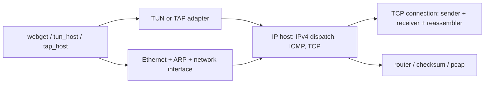

<p align="center">
  
</p>

# minnow-rs


`minnow-rs` is a small user-space TCP/IP stack written in Rust. It is inspired
by Stanford's CS144 networking labs and shaped as a readable systems project:
small enough to study, but real enough to exchange packets with the Linux
kernel through virtual network devices.

```text
Linux kernel <-> TUN/TAP device <-> minnow-rs <-> TCP/IP modules
```

This is an educational implementation, not a production TCP stack.

## What Works

- Bounded byte streams and out-of-order TCP stream reassembly.
- TCP sender, receiver, wrapping sequence numbers, and bidirectional connection
  state.
- Active open, passive open, ACK, FIN, RST, retransmission, zero-window probing,
  and payload segmentation.
- IPv4, TCP, ICMP echo, Ethernet, and ARP parsing/serialization.
- IPv4 routing with longest-prefix match and TTL handling.
- Linux TUN demo for Layer 3 IPv4 packets.
- Linux TAP demo for Layer 2 Ethernet frames, ARP, IPv4, ICMP, and TCP.
- Classic pcap output that can be opened in Wireshark.
- Unit tests plus integration tests for ARP, ICMP, TCP host, and packet flows.

## Quick Start

Build and run the test suite:

```bash
cargo test --all-targets
cargo clippy --all-targets -- -D warnings
```

The real TUN/TAP demos require Linux with `iproute2`, `ping`, `nc`, and optional
Wireshark. Device setup and cleanup use `sudo`; the Rust binaries run as the
current user.

Run the Layer 3 TUN demo:

```bash
./scripts/tun_host.sh run
./scripts/tun_host.sh ping
wireshark target/minnow-captures/tun-host.pcap
./scripts/tun_host.sh clean
```

Run the Layer 2 TAP demo:

```bash
./scripts/tap_host.sh run
./scripts/tap_host.sh ping
wireshark target/minnow-captures/tap-host.pcap
./scripts/tap_host.sh clean
```

The default demo addresses are:

```text
kernel side : 169.254.144.1
minnow-rs   : 169.254.144.2
TCP port    : 9090
```

## TCP Demo

Terminal 1:

```bash
./scripts/tap_host.sh listen
```

Terminal 2:

```bash
./scripts/tap_host.sh run
```

`tap_host` opens a TCP connection to `169.254.144.1:9090`. Bytes typed into the
`tap_host` terminal should arrive in the native `nc` listener. The generated
pcap should show the TCP handshake, data packets, and acknowledgments.

The same flow can be run over TUN with `./scripts/tun_host.sh listen` and
`./scripts/tun_host.sh run`.

## TUN and TAP

`tun_host` attaches to a Layer 3 interface. The kernel gives the process raw
IPv4 datagrams, which makes this path useful for focusing on IPv4, ICMP, and
TCP behavior.

`tap_host` attaches to a Layer 2 interface. The kernel gives the process
Ethernet frames, so this path exercises Ethernet parsing, ARP resolution, the
ARP cache, pending datagram queues, and the bridge from Layer 2 to Layer 3.

## Architecture



See [docs/architecture.md](docs/architecture.md) for the module map and the
packet flow through the TUN and TAP demos.

## Packet Captures

The demo binaries write classic pcap files:

- `tun_host` writes raw IPv4 captures.
- `tap_host` writes Ethernet captures, including ARP.

Useful Wireshark filters:

```text
icmp
arp
tcp.port == 9090
ip.addr == 169.254.144.2
eth.addr == 02:00:00:00:00:02
```

See [docs/wireshark-pcap.md](docs/wireshark-pcap.md) for expected packet
sequences and capture commands.

## Near-Term Scope

The next protocol pieces are intentionally small and observable:

- IPv4 fragmentation/reassembly for simple in-order and out-of-order fragments,
  without trying to implement every production edge case at once.
- ICMP destination unreachable and TTL exceeded messages for dropped datagrams.
- More complete TCP connection teardown around FIN exchange and final closed
  state.

## Repository Layout

```text
src/byte_stream.rs         bounded in-memory byte stream
src/reassembler.rs         out-of-order TCP stream reassembly
src/tcp_sender.rs          send-side TCP logic
src/tcp_receiver.rs        receive-side TCP logic
src/tcp_connection.rs      bidirectional TCP connection state
src/ipv4_datagram.rs       IPv4 wire format
src/icmp.rs                ICMP echo support
src/ethernet_frame.rs      Ethernet frame wire format
src/arp.rs                 ARP packet wire format
src/network_interface.rs   ARP cache and L2/L3 bridge
src/router.rs              longest-prefix-match IPv4 router
src/tun.rs                 Linux TUN adapter
src/tap.rs                 Linux TAP adapter
src/ip_host.rs             reusable host logic for demos
src/pcap.rs                classic pcap writer
src/bin/tun_host.rs        Layer 3 Linux demo
src/bin/tap_host.rs        Layer 2 Linux demo
tests/packet_flows.rs      cross-module packet-flow tests
```

## CI

The GitHub Actions workflow runs the same checks used locally:

```bash
cargo fmt --all -- --check
cargo clippy --all-targets -- -D warnings
cargo test --all-targets
```

## License

This project is licensed under the MIT License. See [LICENSE](LICENSE).
