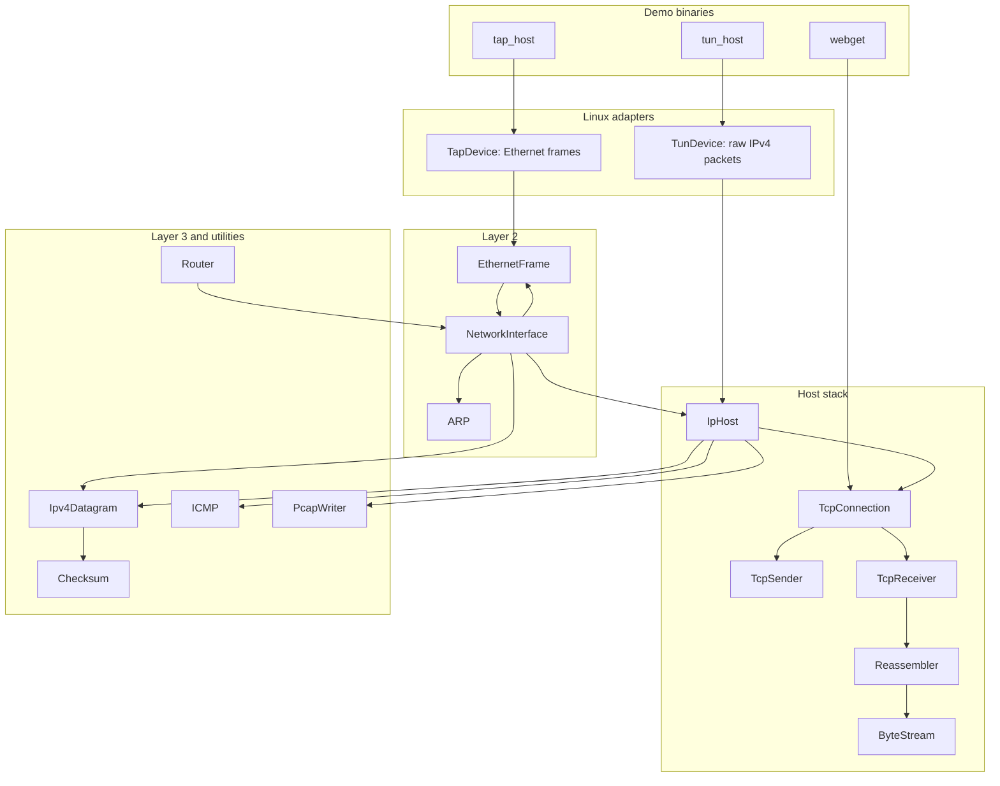

# Architecture

`minnow-rs` is organized as a small protocol stack. The lower modules parse and
serialize packets, while the host binaries connect those modules to Linux
virtual network devices.

## Layer Map



## TUN Packet Flow

TUN is a Layer 3 interface. The kernel gives the process IPv4 packets directly:

```text
kernel IPv4 packet
  -> TunDevice
  -> IpHost
  -> ICMP echo reply or TCP connection
  -> IpHost
  -> TunDevice
  -> kernel
```

This path is the fastest way to inspect IPv4, ICMP, and TCP behavior because it
does not involve Ethernet framing or ARP.

## TAP Packet Flow

TAP is a Layer 2 interface. The kernel gives the process Ethernet frames:

```text
kernel Ethernet frame
  -> TapDevice
  -> EthernetFrame parser
  -> NetworkInterface
  -> ARP handling or IPv4 delivery
  -> IpHost
  -> NetworkInterface
  -> TapDevice
  -> kernel
```

This path is closer to a real network interface. Before the first IPv4 packet,
the Linux kernel may send ARP requests for the stack IP. The `NetworkInterface`
module answers ARP, caches Ethernet addresses, and queues IPv4 datagrams while
resolution is pending.

## Capture Points

The host demos write pcap files near the device boundary:

- `tun_host` writes raw IPv4 packets with a raw-IP link type.
- `tap_host` writes full Ethernet frames with an Ethernet link type.

That placement makes the captures match what the virtual device sees, which is
also what you usually want to debug in Wireshark.
